# NIDS/NIPS amb Suricata

## Objectiu de la pràctica

En aquesta pràctica he muntat un entorn amb tres màquines virtuals per provar Suricata com a sistema de detecció i prevenció d'atacs. La idea principal és tenir una màquina atacant, una màquina víctima i una màquina al mig fent de router. Aquesta màquina del mig és `SAD-Suricata`, i és on he instal·lat Suricata, `nftables`, Alloy, Loki i Grafana. Això permet que el trànsit entre l'atacant i la víctima passi per Suricata aixi, Suricata pot veure què està passant, generar alertes i, quan treballa en mode IPS, també pot bloquejar trànsit.

---

# 1. Preparació de l'entorn

Per començar he preparat tres màquines virtuals a VirtualBox. L'entorn s'ha muntat sobre Windows 10, i les màquines utilitzen Ubuntu.

La primera màquina és `SAD-Atacante`. Aquesta màquina serveix per generar trànsit i fer proves contra la víctima. Té Ubuntu Desktop perquè per mi és més còmode i fàcil uilitzar Firefox, terminal i Grafana.

La segona màquina és `SAD-Suricata`. Aquesta és la màquina més important de la pràctica, perquè està entre la xarxa de l'atacant i la xarxa de la víctima. Té Ubuntu Server i fa de router, IDS/IPS i servidor de monitorització.

La tercera màquina és `SAD-Víctima`. Aquesta màquina rep el trànsit de prova, he instal·lat Apache per provar connexions HTTP i també SSH per comprovar que Suricata pot bloquejar aquest trànsit.

La xarxa de l'atacant utilitza el rang `192.168.100.0/24`. La xarxa de la víctima utilitza el rang `192.168.200.0/24`.

La màquina `SAD-Atacante` té la IP `192.168.100.44/24`. La màquina `SAD-Víctima` té la IP `192.168.200.22/24`. La màquina `SAD-Suricata` té dos IPs internes: `192.168.100.33/24` a la xarxa de l'atacant i `192.168.200.10/24` a la xarxa de la víctima. A més, totes les maquines tenien una interfície NAT, per poder tenir Internet i instal·lar paquets.

---

# 2. Configuració de xarxa de les 3 màquines

## 2.1 Configuració de xarxa de SAD-Atacante

A la màquina `SAD-Atacante` he configurat la IP `192.168.100.44/24`. Aquesta màquina està connectada a la xarxa interna que li he posat el nom `sad-red100`, que és la xarxa de l'atacant i té una interfície NAT per poder sortir a Internet. A més, he configurat una ruta perquè pugui arribar a la xarxa de la víctima, aquesta ruta indica que per arribar a `192.168.200.0/24`, el trànsit ha de passar per `192.168.100.33`, que és la IP de `SAD-Suricata` a la xarxa de l'atacant.

Per comprovar la configuració he utilitzat:

```bash
ip -br a
ip route
```

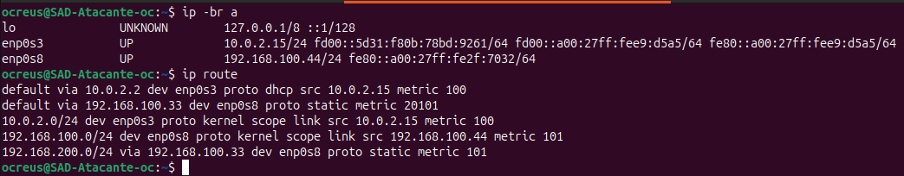

Aqui podem veure que `SAD-Atacante` té la IP correcta i que també té la ruta cap a la xarxa de la víctima.

---

## 2.2 Configuració de xarxa de SAD-Suricata

A la màquina `SAD-Suricata` he configurat tres interfícies de xarxa. La interfície NAT té la IP `10.0.2.15/24` i serveix per tenir Internet. La interfície `enp0s8` té la IP `192.168.100.33/24` i està connectada a la xarxa de l'atacant. La interfície `enp0s9` té la IP `192.168.200.10/24` i està connectada a la xarxa de la víctima. Aquesta màquina és la que comunica les dos xarxes. Per això és important que tingui una IP dins de cada xarxa interna.

Per comprovar la configuració he executat:

```bash
ip -br a
ip route
```

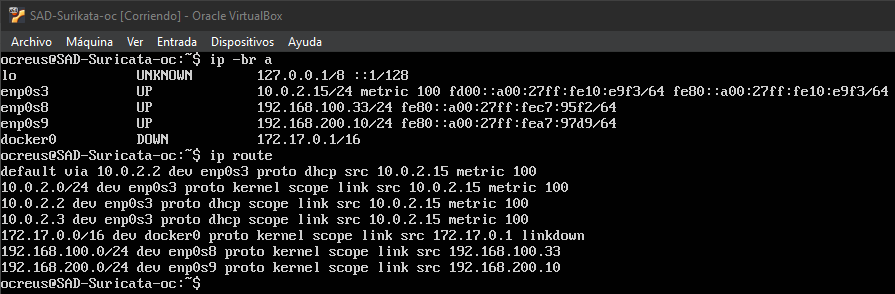

En aquesta captura es veu que `SAD-Suricata` té les IPs correctes a les dos xarxes internes.

---

## 2.3 Configuració de xarxa de SAD-Víctima

A la màquina `SAD-Víctima` he configurat la IP `192.168.200.22/24`.

Aquesta màquina està connectada a la xarxa interna `sad-red200`, que és la xarxa de la víctima i la interfície NAT per poder instal·lar paquets de Internet. També he afegit una ruta perquè la víctima pugui comunicar-se amb l'atacant, aquesta ruta indica que per arribar a `192.168.100.0/24`, el trànsit ha de passar per `192.168.200.10`, que és la IP de `SAD-Suricata` a la xarxa de la víctima.

Per comprovar-ho he executat:

```bash
ip -br a
ip route
```

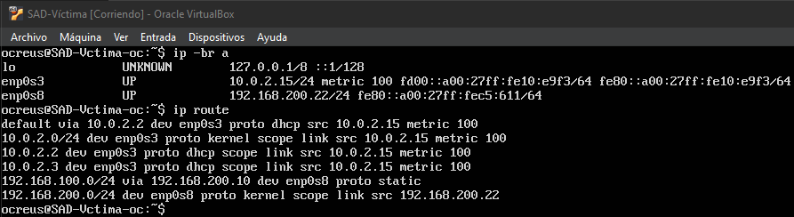

En aquesta captura es pot veure que la IP de la víctima i la ruta a la xarxa de l'atacant.

---

## 2.4 Activació del reenviament IP

Perquè `SAD-Suricata` pugui fer de router entre les dos xarxes, he activat el reenviament IP.

Primer he comprovat l'estat amb:

```bash
cat /proc/sys/net/ipv4/ip_forward
```

El resultat correcte és:

```text
1
```

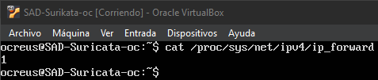

Si aquest valor sigues `0`, la màquina `SAD-Suricata` no reenviaria trànsit entre les dos xarxes i la comunicació entre atacant i víctima donaria error.

---

# 3. Instal·lació, configuració i proves de nftables

## 3.1 Instal·lació de nftables

A la màquina `SAD-Suricata` he instal·lat `nftables`, que es una eina que s'utilitza per controlar el trànsit de xarxa. En aquesta pràctica, `nftables` és important perquè després envia el trànsit a Suricata quan treballem en mode IPS, basicament vol dir que permet que Suricata no només detecti el trànsit "dolent", sinó que també el pugui bloquejar abans que arribi a la màquina víctima.

La instal·lació la he fet amb:

```bash
sudo apt install -y nftables
```

Després he activat el servei:

```bash
sudo systemctl enable nftables
sudo systemctl start nftables
```

I per últim he comprovat l'estat amb:

```bash
systemctl status nftables
```

---

## 3.2 Primera configuració de nftables

Primer he deixat `nftables` en mode permissiu, això vol dir que no bloquejava res. Ho he fet així perquè abans de començar a bloquejar paquets era millor comprovar que la xarxa funcionava bé. Si poses regles de bloqueig al principi, després és més difícil saber si el problema és de xarxa, de rutes o del firewall.

Llavors al pricipi he configurat `/etc/nftables.conf` així:

```conf
#!/usr/sbin/nft -f

flush ruleset

table inet filter {
    chain input {
        type filter hook input priority 0;
        policy accept;
    }

    chain forward {
        type filter hook forward priority 0;
        policy accept;
    }

    chain output {
        type filter hook output priority 0;
        policy accept;
    }
}
```

Després he aplicat la configuració amb:

```bash
sudo nft -f /etc/nftables.conf
```

---

## 3.3 Configuració de nftables amb NFQUEUE

Quan Suricata ja estava preparat per treballar com a IPS, he configurat nftables perquè enviés el trànsit a la cua 0, aquesta cua és el punt on Suricata revisa els paquets abans de deixar-los passar o bloquejar-los.

La configuració acabada de `/etc/nftables.conf` ha quedat així:

```conf
#!/usr/sbin/nft -f

flush ruleset

table inet filter {
    chain input {
        type filter hook input priority 0;
        policy accept;
    }

    chain forward {
        type filter hook forward priority 0;
        policy accept;

        ip saddr 192.168.100.0/24 ip daddr 192.168.200.0/24 counter queue num 0 bypass
        ip saddr 192.168.200.0/24 ip daddr 192.168.100.0/24 counter queue num 0 bypass
    }

    chain output {
        type filter hook output priority 0;
        policy accept;
    }
}
```

La part important és `queue num 0`, això fa que el trànsit passi per la cua `0`, que és on Suricata escolta quan està en mode IPS. Jo, quan faig la comprovació, el sistema ho ensenya com `queue flags bypass to 0`. És el mateix, simplement ho mostra amb una altra forma.

Per comprovar-ho he executat:

```bash
sudo nft list ruleset
```

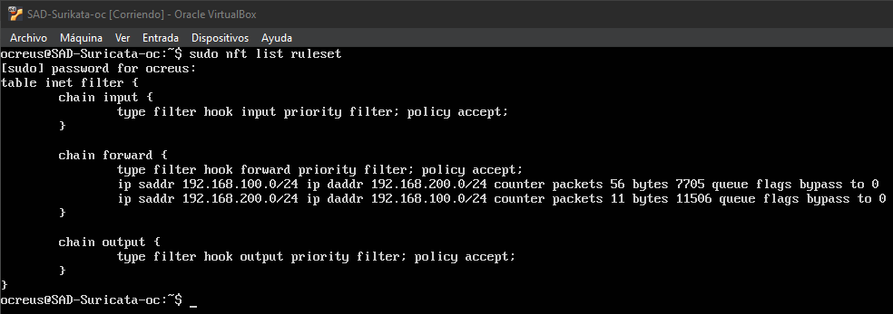

En aquesta captura també es veu que els comptadors de paquets pugen per tant el trànsit està passant per aquestes regles.

---

# 4. Instal·lació, configuració i proves de Suricata

## 4.1 Instal·lació de Suricata

A la màquina `SAD-Suricata` he instal·lat Suricata amb:

```bash
sudo apt install -y suricata suricata-update ethtool
```

Després he actualitzat les regles de Suricata amb:

```bash
sudo suricata-update
```

Per comprovar la instal·lació he utilitzat:

```bash
suricata --build-info
```

---

## 4.2 Ajust de la interfície de Suricata

Al principi Suricata intentava escoltar a la interfície `eth0`, però aquesta interfície no existia a la meva màquina. En el meu cas, les interfícies eren `enp0s8` i `enp0s9`. La interfície `enp0s8` és la xarxa de l'atacant i la interfície `enp0s9` és la xarxa de la víctima.

Per corregir-ho he editat el fitxer:

```bash
sudo nano /etc/suricata/suricata.yaml
```

I he canviat la interfície incorrecta per la interfície real. Aquest pas és bastant important perquè si Suricata escolta en una interfície que no toca, el servei pot estar actiu però no veure el trànsit correcte i pot sembla que tot funciona, però realment no està analitzant el que ha d'analitzar.

També he desactivat opcions d'offloading amb `ethtool`:

```bash
sudo ethtool -K enp0s8 gro off lro off gso off tso off
sudo ethtool -K enp0s9 gro off lro off gso off tso off
```

Això ajuda a evitar problemes amb la manera com la targeta de xarxa gestiona els paquets.

---

## 4.3 Configuració de HOME_NET

Dins de `/etc/suricata/suricata.yaml`, he configurat `HOME_NET` amb la xarxa de l'atacant i la xarxa de la víctima..

La configuració ha quedat així:

```yaml
vars:
  address-groups:
    HOME_NET: "[192.168.100.0/24,192.168.200.0/24]"
    EXTERNAL_NET: "!$HOME_NET"
```

Això serveix perquè Suricata sàpiga quines xarxes són internes.

---

## 4.4 Creació de regles locals

Per fer les proves, he creat regles locals a:

```text
sudo nano /etc/suricata/rules/local.rules
```

Les regles finals han sigut aquestes:

```conf
alert icmp 192.168.100.0/24 any -> 192.168.200.0/24 any (msg:"ICMP detectat de l'atacant cap a la víctima"; sid:1000001; rev:2;)
alert tcp 192.168.100.0/24 any -> 192.168.200.22 80 (msg:"Connexio HTTP detectada cap a la víctima"; sid:1000002; rev:2;)

drop icmp 192.168.100.0/24 any -> 192.168.200.0/24 any (msg:"ICMP bloquejat per Suricata IPS"; sid:1000003; rev:1;)
drop tcp 192.168.100.0/24 any -> 192.168.200.0/24 22 (msg:"SSH bloquejat per Suricata IPS"; sid:1000004; rev:1;)
```

La primera regla detecta pings de l'atacant cap a la víctima. La segona regla detecta connexions HTTP cap a la víctima. La tercera regla bloqueja ICMP (és el protocol que fa servir el ping) quan Suricata treballa en mode IPS. La quarta regla bloqueja connexions SSH cap a la víctima. Per comprovar que les regles estaven guardades he executat:

```bash
sudo grep -n "100000" /etc/suricata/rules/local.rules
```

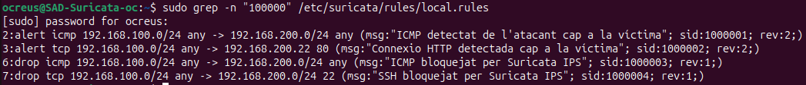

---

## 4.5 Validació de la configuració

Abans de reiniciar Suricata, he comprovat que la configuració fos correcta:

```bash
sudo suricata -T -c /etc/suricata/suricata.yaml
```

Si la configuració està bé, Suricata indica que el fitxer s'ha carregat correctament.

Després he reiniciat el servei:

```bash
sudo systemctl restart suricata
```

I he comprovat l'estat amb:

```bash
systemctl status suricata
```

---

## 4.6 Configuració de Suricata en mode IPS

Primer Suricata funcionava com a IDS, és a dir, detectava trànsit però no el bloquejava. Perquè pogués bloquejar, l'he configurat en mode IPS amb `NFQUEUE`. Per fer-ho he creat un fitxer de configuració extra del servei que serveix per canviar la manera com arrenca Suricata, sense modificar directament el servei original.

```bash
sudo mkdir -p /etc/systemd/system/suricata.service.d/
sudo nano /etc/systemd/system/suricata.service.d/override.conf
```

El fitxer l'he modificat i l'he deixat aixi:

```ini
[Service]
ExecStart=
ExecStart=/usr/bin/suricata -D -c /etc/suricata/suricata.yaml -q 0 --runmode autofp --pidfile /run/suricata.pid
```

La part clau, important és `-q 0`. Això indica que Suricata escolta a la cua `0`.

Després he reiniciat systemd i Suricata:

```bash
sudo systemctl daemon-reload
sudo systemctl restart suricata
```

Per comprovar que realment estava funcionant en mode IPS he executat:

```bash
systemctl status suricata --no-pager -l
```

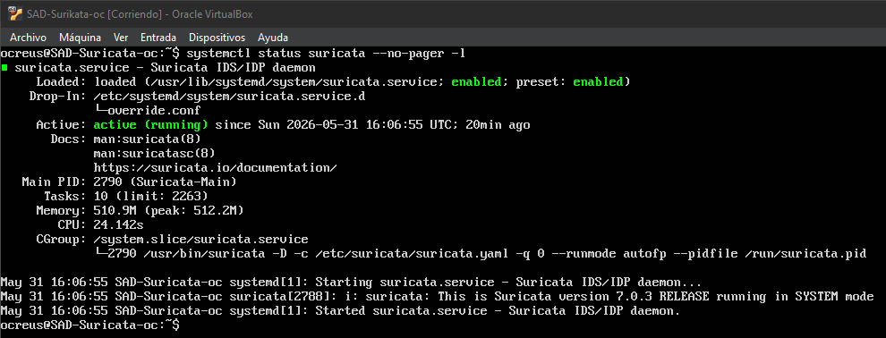

En aquesta captura es veu que Suricata està actiu i que arrenca amb `-q 0`.

---

## 4.7 Proves amb Suricata

Per provar Suricata he fet servir tres proves diferents des de `SAD-Atacante`.

Primer he provat un ping a la víctima:

```bash
ping 192.168.200.22
```

Aquest trànsit queda bloquejat perquè hi ha una regla `drop icmp`.

Després he provat HTTP a l'Apache de la víctima:

```bash
curl http://192.168.200.22
```

Aquesta prova funciona perquè HTTP només està configurat com a alerta, no com a bloqueig.

Per ultim, he provat SSH:

```bash
ssh ocreus@192.168.200.22
```

Aquesta connexió es bloqueja perquè hi ha una regla que bloqueja el port `22`.

Per veure les alertes i bloquejos he mirat el fitxer:

```bash
sudo tail -n 20 /var/log/suricata/fast.log
```

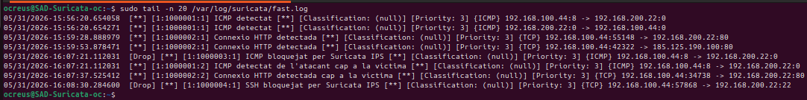

En aquesta captura es veu que Suricata detecta ICMP, detecta HTTP i bloqueja ICMP i SSH.

---

# 5. Instal·lació, configuració i proves de Alloy + Loki + Grafana

## 5.1 Objectiu d'aquesta part

Després de tenir Suricata funcionant, he configurat Alloy, Loki i Grafana. Suricata genera logs al fitxer `eve.json`. Alloy llegeix aquest fitxer i envia els logs a Loki, després Grafana consulta Loki i mostra els logs en una interfície web. Això és útil perquè mirar logs per terminal funciona, però quan hi ha moltes dades és bastant difícil d'analitzar, amb Grafana queda més visual i es pot veure millor què està passant, com amb el projecte.

---

## 5.2 Instal·lació de Loki, Grafana i Alloy

Primer he afegit el repositori de Grafana:

```bash
sudo apt install -y apt-transport-https software-properties-common wget gpg
sudo mkdir -p /etc/apt/keyrings
wget -q -O - https://apt.grafana.com/gpg.key | gpg --dearmor | sudo tee /etc/apt/keyrings/grafana.gpg > /dev/null
echo "deb [signed-by=/etc/apt/keyrings/grafana.gpg] https://apt.grafana.com stable main" | sudo tee /etc/apt/sources.list.d/grafana.list
sudo apt update
```

Després he instal·lat els serveis:

```bash
sudo apt install -y loki grafana alloy
```

---

## 5.3 Configuració i prova de Loki

He activat Loki amb:

```bash
sudo systemctl enable loki
sudo systemctl start loki
```

Per comprovar que el servei estava actiu he executat:

```bash
systemctl status loki --no-pager -l
```

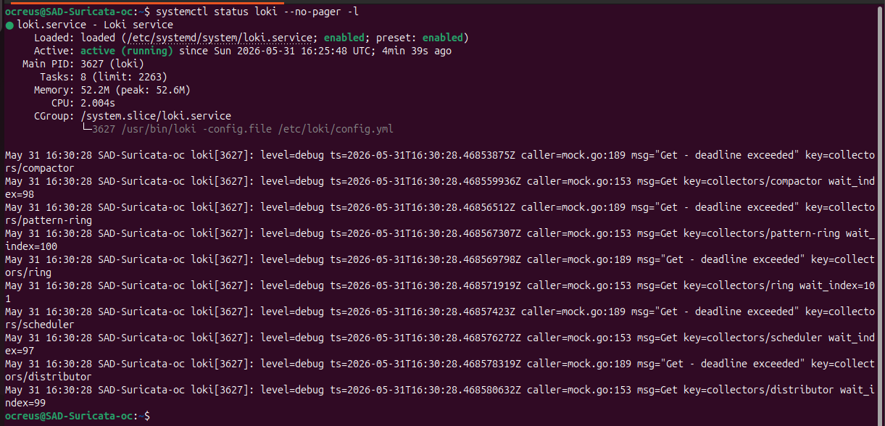

També he comprovat que Loki escoltava pel port `3100`:

```bash
ss -tulnp | grep 3100
```

I he comprovat que tot estigues bé amb:

```bash
curl http://127.0.0.1:3100/ready
```

Al principi Loki ensenya un missatge indicant que encara no estava preparat del tot, després d'esperar una mica, el servei ja va quedar preparat.

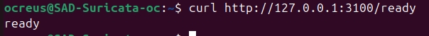

---

## 5.4 Comprovació del fitxer eve.json

Suricata genera el fitxer:

```text
/var/log/suricata/eve.json
```

Aquest fitxer guarda la informació que genera Suricata en format JSON, després Alloy llegeix aquest fitxer i envia els logs cap a Loki. Per comprovar que existia i que tenia alertes he executat:

```bash
ls -lh /var/log/suricata/eve.json
sudo grep '"event_type":"alert"' /var/log/suricata/eve.json | tail -n 3
```

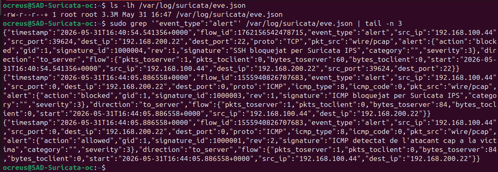

En aquesta captura podem veure que el fitxer existeix i que Suricata està generant alertes.

---

## 5.5 Configuració d'Alloy

Alloy és l'eina que he fet servir per llegir el fitxer `eve.json` i enviar-lo a Loki.

He editat el fitxer:

```bash
sudo nano /etc/alloy/config.alloy
```

La configuració és aquesta:

```alloy
loki.source.file "suricata" {
  targets = [
    {
      __path__ = "/var/log/suricata/eve.json",
      job      = "suricata-logs",
      host     = "SAD-Suricata",
      source   = "evejson",
    },
  ]

  forward_to = [loki.write.local.receiver]
}

loki.write "local" {
  endpoint {
    url = "http://127.0.0.1:3100/loki/api/v1/push"
  }
}
```

Amb això, Alloy llegeix `/var/log/suricata/eve.json` i envia aquests logs a Loki amb l'etiqueta `job="suricata-logs"`.

Aquesta etiqueta és important perquè després és la que he fet servir a Grafana per comprobar els logs.

---

## 5.6 Permisos per a Alloy

Com que `eve.json` és un fitxer generat per Suricata, Alloy necessita permisos per poder llegir-lo.

Primer he instal·lat `acl`:

```bash
sudo apt install -y acl
```

Després he donat permisos a l'usuari `alloy`:

```bash
sudo setfacl -m u:alloy:r /var/log/suricata/eve.json
sudo setfacl -m u:alloy:rx /var/log/suricata
```

Després he reiniciat Alloy:

```bash
sudo systemctl enable alloy
sudo systemctl restart alloy
```

I he comprovat que no hi haguessin problemes amb:

```bash
systemctl status alloy
```

---

## 5.7 Configuració de Grafana

He activat Grafana amb:

```bash
sudo systemctl enable grafana-server
sudo systemctl start grafana-server
```

Després he accedit des del navegador de `SAD-Atacante` a:

```text
http://192.168.100.33:3000
```

El user i password són:

```text
Usuari: admin
Contrasenya: admin
```

A Grafana he afegit Loki com el lloc d’on ha de llegir els logs, i com que Loki està instal·lat a la mateixa màquina que Grafana, he posat la URL `http://localhost:3100`.

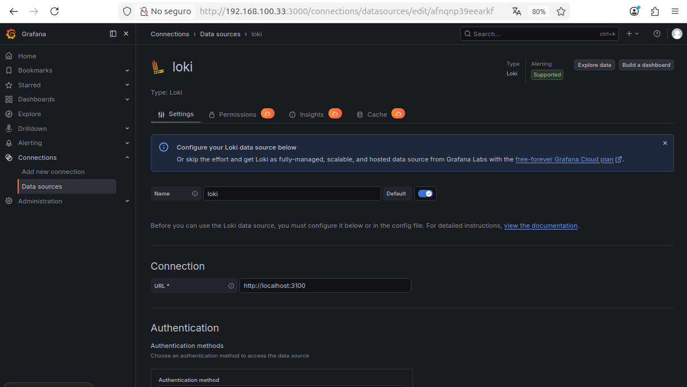

Amb això Grafana ja podia consultar els logs guardats a Loki.

---

## 5.8 Prova de logs a Grafana

Per comprovar que Grafana rebia els logs, he entrat a `Explore` i he seleccionat la font de dades Loki. La primera consulta que he provat és aquesta:

```logql
{job="suricata-logs"}
```

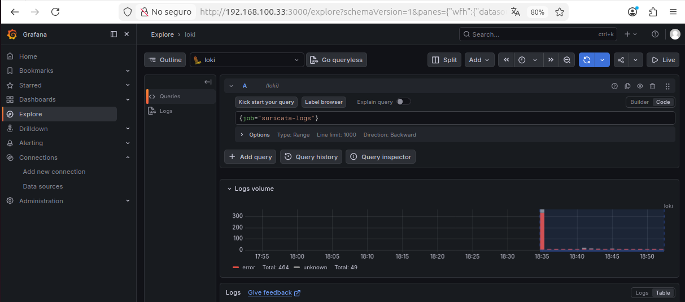

Aqui veiem que Grafana està rebent dades de Loki. També he provat una consulta més concreta per veure només alertes:

```logql
{job="suricata-logs"} | json | event_type="alert"
```

---

## 5.9 Creació d'un dashboard a Grafana

Per últim he creat un dashboard a Grafana per veure les alertes de Suricata d'una manera més clara. Dins de Grafana he anat a `Dashboards`, he creat un nou dashboard i he afegit un panell. La font de dades del panell és Loki i la consulta utilitzada és:

```logql
{job="suricata-logs"} | json | event_type="alert"
```

He posat el nom `Alertes Suricata` al panell perquè mostra les alertes que genera Suricata i he guardat tot el dashboard com `Suricata - Monitorització`.

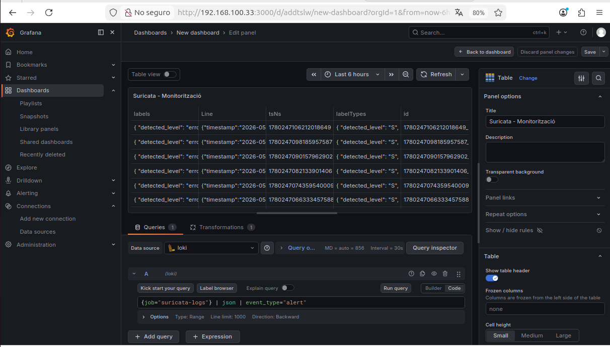

Aquesta última captura ensenya que els logs de Suricata es poden consultar des de Grafana.

---

# Problemes trobats durant la pràctica

## Problema amb la xarxa de la víctima

Al principi, la víctima no responia correctament des de Suricata ni des de l'atacant. Després de una estona buscant el problema he vist que era que la interfície interna de `SAD-Víctima` estava malament a VirtualBox, estava a la xarxa de l'atacant quan havia d'estar a la xarxa de la víctima. He posat la víctima a la xarxa `sad-red200` i he deixat la IP final com `192.168.200.22/24`, i amb aquest canvi la comunicació entre víctima i Suricata ja funcionava.

---

## Problema amb la IP de la víctima

També m'he liat amb la IP de la víctima. En algun moment estava fent les proves contra `192.168.200.22`, però la màquina tenia una altra IP configurada. Ho he solucionat deixant la IP final de la víctima com `192.168.200.22` i fer que tota la documentació i totes les proves utilitzessin aquesta mateixa IP.

---

## Problema amb el mode IPS

Suricata primer funcionava com a IDS, osigui, detectava trànsit però no el bloquejava. Perquè funcionés com IPS he hagut de fer dos coses, primer, configurar `nftables` perquè enviés el trànsit a la cua `0`. Després, fer que Suricata arranqués amb `-q 0`. Això s'ha fet amb el fitxer:

```text
/etc/systemd/system/suricata.service.d/override.conf
```

Després d'això, Suricata ja podia bloquejar ICMP i SSH.

---

## Problema inicial amb Loki

Quan vaig provar que tot estaba bé:

```bash
curl http://127.0.0.1:3100/ready
```

Al principi Loki encara no estava preparat del tot pero amb paciencia, Loki es va posar actiu i escoltant al port `3100`.

---

# Comprovacions finals

Per comprovar la configuració de xarxa he utilitzat:

```bash
ip -br a
ip route
```

Amb això he revisat les IPs i les rutes de les tres màquines.

Per comprovar que `SAD-Suricata` podia fer de router he utilitzat:

```bash
cat /proc/sys/net/ipv4/ip_forward
```

Per revisar les regles de `nftables` he utilitzat:

```bash
sudo nft list ruleset
```

Aquí he comprovat que el trànsit entre les dos xarxes passava per la cua `0`.

Per revisar Suricata he utilitzat:

```bash
systemctl status suricata --no-pager -l
```

Amb això he comprovat que Suricata estava actiu, que no tenia ningun error i funcionant amb `-q 0`.

Per revisar les alertes i bloquejos he utilitzat:

```bash
sudo tail -n 20 /var/log/suricata/fast.log
```

Per comprovar Loki he utilitzat:

```bash
systemctl status loki --no-pager -l
ss -tulnp | grep 3100
curl http://127.0.0.1:3100/ready
```

Per acabar ja només he entrat al Firefox amb:

```text
http://192.168.100.33:3000
```

I he fet consultes a Loki amb:

```logql
{job="suricata-logs"}
```

i també amb:

```logql
{job="suricata-logs"} | json | event_type="alert"
```
